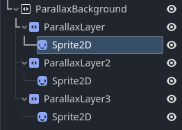
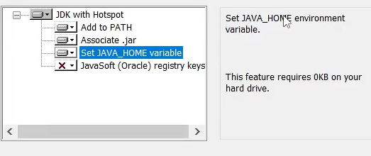
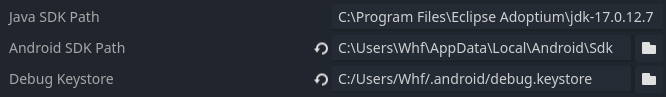
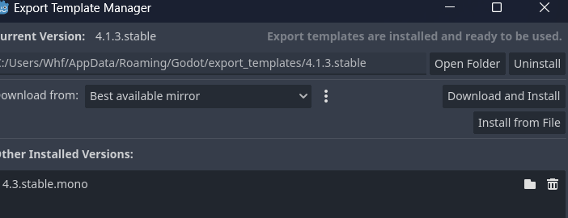
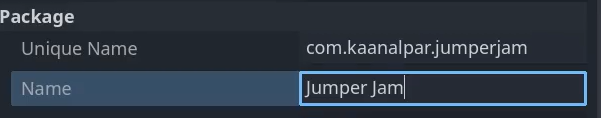

## 随笔

### project settings

#### window

##### handheld

landscape是横屏，portrait是竖屏。

当我们使用viewport_height和viewport_width时，这实际上只是在电脑上测试所用，一般是16：9，实际游戏运行应该使用手机的屏幕大小，所以手机游戏会频繁用到一个东西就是get viewport_size()函数

##### stretch

在该项目中Mode为canvas_items,Aspect为keep width,这样做的目的是为了保持当游戏屏幕拉伸后纹理不会变形

#### pointing

将两个都勾选以便调试；

### Game Arc


游戏的所有内容都将在Game里面，所以的UI将会在Screens里面，Main负责二者之间的通信

当我们创建了这三个场景后，在main里面点击链接图标，也就是Instantiate child scene,当我们点击运行后就可以了。

#### Player

当我们搭建好舞台后，最重要的就是角色，所以我们应该创建一个以characterbody2d节点为根节点的场景


Sprite2d是外形，shaper2d是碰撞，animationplayer是动画

这里来记录一下AnimationPlayer的使用，因为使用精灵动画，也就是帧动画，所以使用播放模式；

点击AnimationPlayer后在下侧的Animation选项上有new选项，new后将一个状态如下设置


jump同理

在脚本中

```
@onready var animator=$AnimationPlayer

func _process(_delta):
	if velocity.y>0:
		if animator.current_animation!="Fall":
			animator.play("Fall")

	elif velocity.y<0:
		if animator.current_animation!="Jump":
			animator.play("Jump")
```

由于y轴上速度的不同，引起动画的不同

#### game camera

我们需要一个镜头跟随玩家，否则当玩家出了调试窗口，我们无法跟随；

首先，camera也是一个场景，其根节点为Camera2D，我们需要跟随玩家的话，肯定需要玩家的一些信息，比如位置之类的。

如何拿到玩家的信息呢?

1. 首先在Player的脚本中声明 class_name Player
2. 在game_camera脚本中声明变量 var player:Player=null
3. 对该变量进行赋值,编写如下函数

```
func setup_camera(_player: Player):
	if _player:
		player=_player
```

4. 在一个有Player实例的地方调用这个函数就可以了，因为架构原因，我们在Game里面调用这个函数,首先在Game中实例化Player，先声明一个player的变量，然后preload函数加载player场景
5. func new_game():

   player=player_scene.instantiate()
   player.global_position =player_spawn_position
   add_child(player)

   camera=camera_player.instantiate()
   camera.setup_camera(player)
   add_child(camera)

这样就拿到了player的信息，在camera脚本中让camera的global_position.y等于player的global_position.y就可以,这camera始终位于屏幕的正中间，这样

他就会始终跟随玩家了；

### Collision

#### layer&mask

关于godot的碰撞，目前接触到最简单的也是比较好用的是layer与mask,怎么使用呢？将自身的碰撞层级放在layer里面，将想要与你的碰撞响应的放在mask里面。

举个例子，我们想要玩家和平台的碰撞响应，那么我将玩家的layer设置为1，mask设置为2.将平台的layer设置为2，make设置为1。可以看出这是将场景进行了编号，想要与谁碰撞将谁的编号放在make里面就可以了。

### Parallax Background

视差效果，这种效果是几层画布以不同的速度在屏幕上流动造成3d效果。比如该项目的背景。



parallax需要设置mirroring,当sprite没有被缩放，那么纹理是多少，就需要在mirroring上设置为多少，但进行了缩放，那么mirroring上的值也是纹理的尺寸*缩放的值，具体代码如下；

```
# 由于不同手机尺寸引起的对纹理所需缩放的计算
func get_parallax_sprite_scale(parallax_sprite:Sprite2D):
	var parallax_texture=parallax_sprite.get_texture()
	var parallax_texture_width=parallax_texture.get_width()

	var _scale=viewport_size.x/parallax_texture_width
	var result=Vector2(_scale,_scale)
	return result

#纹理缩放后设置所需要的motion_mirroring
func setup_parallax_layer(parallax_layer:ParallaxLayer):
	var parallax_sprite=parallax_layer.find_child("Sprite2D")
	if parallax_sprite!=null:
		parallax_sprite.scale=get_parallax_sprite_scale(parallax_sprite)
		var my=parallax_sprite.scale.y*parallax_sprite.get_texture().get_height()

		parallax_layer.motion_mirroring.y=my
```

### Android Export

#### Android Setup

OpenJDK

Android Studio

OpenJDK需要如下设置



在AS中对SDK Manager进行设置，按照对应godot文档的要求就可以。

#### Editor setting



Java SDK path可通过 set java来查询

Debug Keystore通过指令生成

```
keytool -genkey -v -keystore C:\Users\你的用户名\.android\debug.keystore -storepass android -keypass android -alias androiddebugkey -keyalg RSA -keysize 2048 -validity 10000
```

生成后确定放在.android下面。

#### adb

将SDK/platform-tools下的adb路径添加到系统变量中，方便我们进行调试，比如adb logcat等；

#### 模板



#### 更改



现在就可以导出了。如果想在手机上调试，打开手机的开发者选项，打开USB调试。点击godot上的Remote Debug就可以；


### UI

#### signal

信号的使用在这个项目的练习下逐渐清晰了起来，无论是godot提供的信号还是我们自定义的信号都是将有信号的scene放在其他的scene里面，链接这个大scene里的scene,然后会有回调函数。这样做的目的是我们的回调函数可以做的事情就更多了。

#### godot的单例模式

在做该项目的debug_console的时候，我们用到的单例。我们的需求是无论在哪里都可以对日志进行调用那么这个日志肯定是单一的，因为我们不想要很多的日志，这样信息输入到哪个日志也不清楚，所以单例模式应用在日志上是非常之完美的。

我们在文件的script上new一个脚本，并把这个脚本放在projectSetting的AutoLoad里，这个脚本就无需attach在scene上面了，这样就可以全局调用了，我们只需要在里面写我们所需要的函数就可以了。

#### 多个scene共用一个脚本

在该项目中有三个场景，他们具有相似的功能，比如appera(),disappear()等，所以可以让他们公用一个脚本。创建脚本的方法类似于单例，new一个脚本然后attach在scene上面就可以了。

#### tween

翻译为补间动画，指定关键帧，计算机插入关键帧之间的动画。具体的使用观看changescreen.gd

#### groups

在讨论groups技术的时候，我们也就顺带将该项目中的buttons部分也给讲了。

我们在做button的时候，希望button可以复用，而不是每一个scene都去加一个节点，然后再发射信号，这样太复杂了。不如直接做一个scene,就是button的scene。现在我们的需求是按下这类的button后，可以切换不同的scene。所以我们肯定需要button的pressed信号,因为pressed有自己的回调函数，我们我发给他链接一个我们定义的函数，所以我们在pressed信号下面发送我们的信号，然后我们的信号再链接自己的回调函数，这种方法也让我们可以通过pressed来拥有更大的舞台。

那么groups呢？我们在texture_button的groups里面写了"buttons"，这样只要是这个scene创造出来的实例，我们可以通过相应的groups函数来全部拿到。

```
texture_button.tscn

class_name ScreenButton

signal clicked(button)


func _on_pressed():
	clicked.emit(self)

Screens.tscn
func register_buttons():
	var buttons=get_tree().get_nodes_in_group("buttons")
	if buttons.size()>0:
		for button in buttons:
			if button is ScreenButton:
				if button.clicked.is_connected(on_button_pressed):
					button.clicked.disconnect(on_button_pressed)
				button.clicked.connect(on_button_pressed)

func on_button_pressed(button):
	match button.name:
		"StartButton":
			change_screen(null)
			print("start")
		"RestartButton":
			change_screen(titlescreen)
			print("restart")
		"MenuButton":
			change_screen(ggscreen)
			print("Menu")
		"GV_Menu":
			change_screen(titlescreen)
			print("GB_menu")
		"GV_Retry":
			change_screen(pausescreen)
			print("retury")
		"CloseButton":
			change_screen(ggscreen)
			print("close")

func change_screen(newscreen):
	if current_screen!=null:
		var disappear_tween=current_screen.disappear()
		await (disappear_tween.finished)
		current_screen.visible=false
	current_screen=newscreen
	if current_screen!=null:
		var tween=current_screen.appear()
		await(tween.finished)
		get_tree().call_group("buttons","set_disabled",false)
```

可以看到我们自定义的信号，他是有参数的，我们通过这个参数，做到了对button的一系列操作。

#### screen scale & safe area

不同的手机有不同的screen scale 和 safe area，获取他们的方式是通过DisplayerServer来实现的.

```
hud.tscn

func _ready():
	var os_name=OS.get_name()
	if os_name=="iOS"||"Android":
		var safe_area=DisplayServer.get_display_safe_area()
		var safe_area_top=safe_area.position.y
	
		var screen_scale=DisplayServer.screen_get_scale()
		safe_area_top=(safe_area_top/screen_scale)
	
		topbar.position.y+=safe_area_top
		topbar_bk.size.y+=(safe_area_top+10)
```
