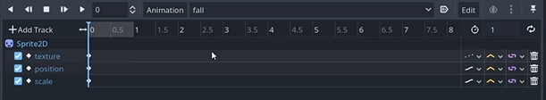

## 随笔

### project settings

#### window

##### handheld

landscape是横屏，portrait是竖屏。

当我们使用viewport_height和viewport_width时，这实际上只是在电脑上测试所用，一般是16：9，实际游戏运行应该使用手机的屏幕大小，所以手机游戏会频繁用到一个东西就是get viewport_size()函数

##### stretch

在该项目中Mode为canvas_items,Aspect为keep width,这样做的目的是为了保持当游戏屏幕拉伸后纹理不会变形

#### pointing

将两个都勾选以便调试；

### Game Arc


游戏的所有内容都将在Game里面，所以的UI将会在Screens里面，Main负责二者之间的通信

当我们创建了这三个场景后，在main里面点击链接图标，也就是Instantiate child scene,当我们点击运行后就可以了。

#### Player

当我们搭建好舞台后，最重要的就是角色，所以我们应该创建一个以characterbody2d节点为根节点的场景


Sprite2d是外形，shaper2d是碰撞，animationplayer是动画

这里来记录一下AnimationPlayer的使用，因为使用精灵动画，也就是帧动画，所以使用播放模式；

点击AnimationPlayer后在下侧的Animation选项上有new选项，new后将一个状态如下设置



jump同理

在脚本中

```
@onready var animator=$AnimationPlayer

func _process(_delta):
	if velocity.y>0:
		if animator.current_animation!="Fall":
			animator.play("Fall")
		
	elif velocity.y<0:
		if animator.current_animation!="Jump":
			animator.play("Jump")
```

由于y轴上速度的不同，引起动画的不同

#### game camera

我们需要一个镜头跟随玩家，否则当玩家出了调试窗口，我们无法跟随；

首先，camera也是一个场景，其根节点为Camera2D，我们需要跟随玩家的话，肯定需要玩家的一些信息，比如位置之类的。

如何拿到玩家的信息呢?

1. 首先在Player的脚本中声明 class_name Player
2. 在game_camera脚本中声明变量 var player:Player=null
3. 对该变量进行赋值,编写如下函数

```
func setup_camera(_player: Player):
	if _player:
		player=_player
```

4. 在一个有Player实例的地方调用这个函数就可以了，因为架构原因，我们在Game里面调用这个函数,首先在Game中实例化Player，先声明一个player的变量，然后preload函数加载player场景
5. func new_game():

   	player=player_scene.instantiate()
   	player.global_position =player_spawn_position
   	add_child(player)

   	camera=camera_player.instantiate()
   	camera.setup_camera(player)
   	add_child(camera)

这样就拿到了player的信息，在camera脚本中让camera的global_position.y等于player的global_position.y就可以,这camera始终位于屏幕的正中间，这样

他就会始终跟随玩家了；
